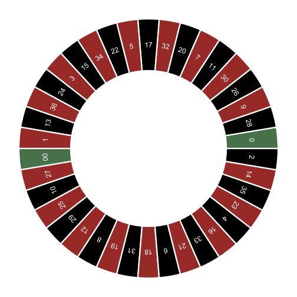
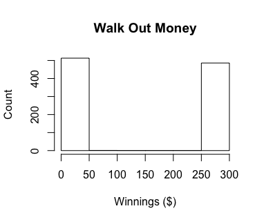
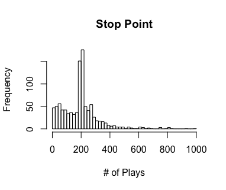
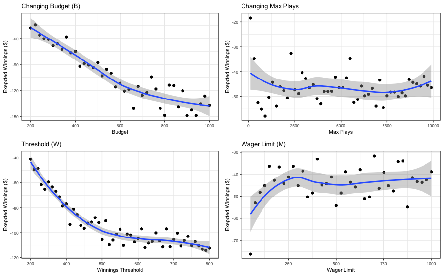

```{r setup, include=FALSE}
knitr::opts_chunk$set(echo = TRUE)
```
<br>

Data science is a very broad category that encompasses probability and statistics, computer science, and data analysis. What's exciting is how easily they can be applied to the world around us. Let's look at how we would apply some of the concepts within data science to model and analyze the Martingale roulette strategy.

***
### Basics: Roulette & Martingale
Before jumping into trying to solve or analyze a problem, we need as much background information as possible. This is critical to helping contenxtualize, identify our operating characteristics (paramters), understand the results, and in the case, correctly generate sample data.

A roulette wheel typically has 38 different numbered pockets that are red (18), black (18), or green (2). After bets are placed, a ball is spun around the wheel and where it lands determines the winner. While there are a number of ways to place bets on the wheel, each with different odds and payouts.

<center><div style="width:50%"></dov></center>

On the wheel, you have the highest odds (47%) of the ball landing in a red or black pocket. In the Martingale strategy, one only bets on red or black pockets. If you win, you keep betting the minimum allowed bet but if you lose you double your bet until another win.

| Wager | Outcome | Winnings |Net Money |
|:-----:|:-------:|:--------:|:--------:|
|   1   |  Black  |    -1    |    -1    |
|   2   |  Black  |    -2    |    -2    |
|   4   |  Black  |    -4    |    -7    |
|   8   |   Red   |    +1    |    +1    |
|   1   |   Red   |    +1    |    +2    |

As you can see, the individual winnings on each Red outcome is very small. That is the essence of the Martingale strategy — over a large volume of plays, the small earnings from wins offset the losses.

***
### Creating a Data Set
Although there _could be_ publicly available data for thousands of roulette plays while employing a single betting strategy, it's highly unlikely and it's relatively easy to create our own through repeated simulations.

Knowing the basics of roulette and the Martingale strategy, we can identify our different parameters. Fortunately with roulette we can keep it simple and straightforward. We have include the maximum wager (M) as a parameter because this is typical for roulette at a casino.

```{r parameters, eval=FALSE}
# Set Parameters
B <- 200      # Budget 
W <- B + 100  # Budget threshold (hit, stop betting)
L <- 5000     # Max number of plays
M <- 1000     # Maximum Wager
```
  
<br>

In order to create our data set, we need to know what we want to evaluate to understand whether or spending all night at the roulette table is a good idea. When gambling, one typically is interested in the probability of winning and expected winnings - so we'll stick with those.

As part of the simulation, we will only be betting on Red outcomes. A critical component when generating a data is evaluating complexities, edge cases, etc. to determine their significance and how to model them. In real roulette there are human, environmental, and other factors that prevent an outcome from being perfectly random. Fortunately, these would have a very small, if any, impact to the outcome of a single spin.

Over a large number of games, we would not expect this to skew the averge and because our simulation will model 1,000 trips to the casiono, we have chosen to remove these complexities and assume random chance.

```{r simulation, eval=FALSE}
# Spin of the wheel
  red <- rbinom(1,1,18/38)

# Looping through simulation
for(j in seq_along(walk_out_money)){
  output <- one_series(B, W, L, M)
  walk_out_money[j] <- output[1][[1]] %>% get_last
  stop_point[j] <- output[2][[1]]$plays
}
```

<br>

### Analyzing Results
After running we get a winning probability of .486 and average earnings of -$54.12. To better understand what this means and how the simulation worked, we've put together a few graphs.

<center>
 

</center>

When looking at the _Walk Out Money_ historgram, the counts of times winning vs loosing look very even; however, the _Stop Point_ histogram tells a different story. Eevery case where the player stopped before we reached L (max number of plays) was due to a stop condition (meeting winnings goal, loosing all money). In repeating this simulation with the same parameters, the results differ slightly but consistantly have an average earnings and winning probability around -$50 and .50, respectively.

So what does this tell us? Under these conditions, we should expect to lose ~$50 for each trip to the roulette table.


***
### More Analysis
As a good data scientist, we should always ask, 'what happens if a parameter changes'? For example, it is very possible that not all casinos have the same wager limits.

Fortnuately we can re-use our code and with a few tweaks, manipulate our paramters independently, output results to a data frame, and graph. A benefit to using data frames is being able to us ggplot - a data visualization package with more advanced functionality. With just a few additional lines of code we were able to add a regression model (loess method) and a confidence interval (95%).

<center><div style="width:80%">

</div></center>

Yikes! Even when looking at a wide range of parameter values, our expected earnings remains negative. The confidence interval is interesting because it shows the variation/error that occurs with simulations. One way this could be reduced is by increase our number of observations for each interval, or repeatedly running simulations for a single interval and recording the mean.

Unfortunately for us it doesn't look like this is the path to riches. What is exciting is that the same principles of simulation, modeling, and analysis can be applied everywhere.

<br><br>